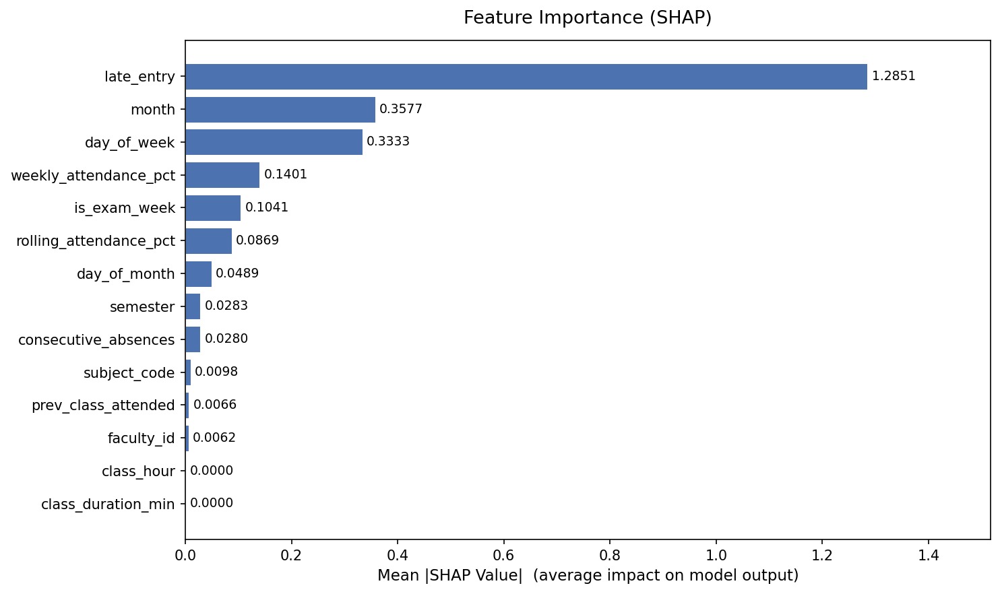
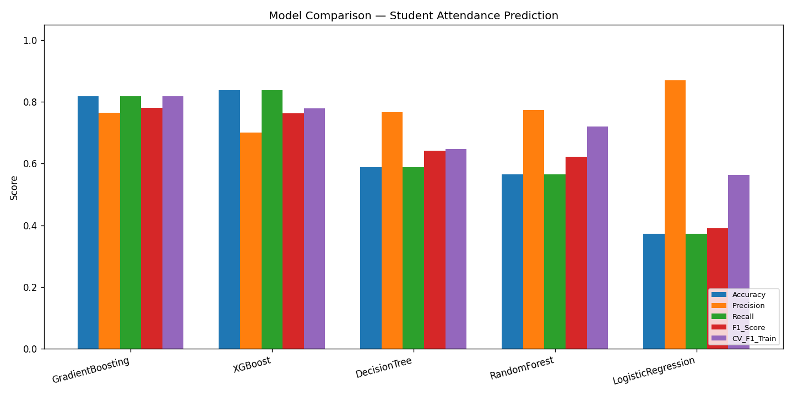
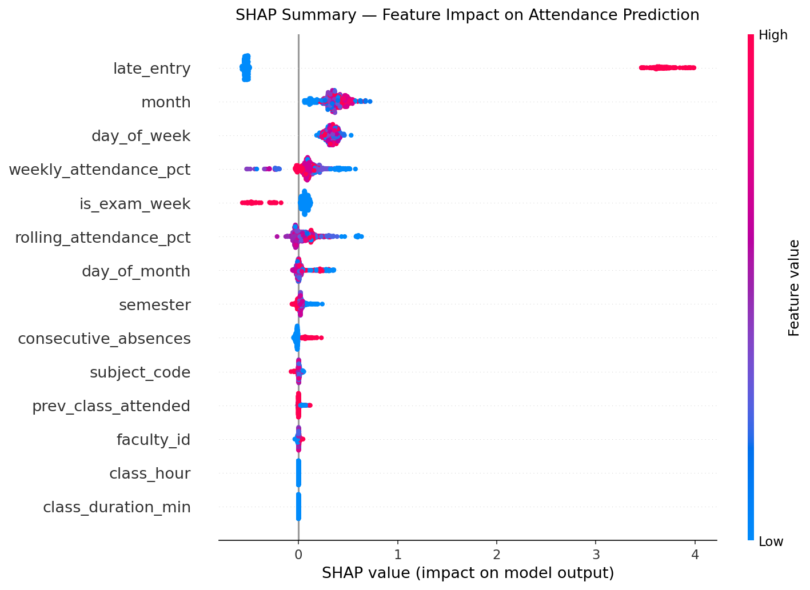

<div align="center">

# 🎓 Student Attendance Predictive System

**ML-powered attendance prediction & gap analysis with a live Streamlit dashboard**

[](https://python.org)
[](https://studentattendancepredictor.streamlit.app)
[](https://supabase.com)
[](https://scikit-learn.org)
[](https://xgboost.readthedocs.io)
[](LICENSE)
[](https://github.com/Ankur0307/student-attendance-predictor)

**🔗 [Live Demo →](https://studentattendancepredictor.streamlit.app)**

</div>

---

## 📸 Dashboard Preview

| Attendance Overview | Gap Report |
|---|---|
|  |  |

| Model Comparison | SHAP Summary |
|---|---|
|  |  |

---

## ✨ Features

| Feature | Description |
|---|---|
| 🤖 **5 ML Models** | Logistic Regression, Decision Tree, Random Forest, Gradient Boosting, XGBoost |
| ⚖️ **SMOTE Balancing** | Handles 84% Present / 16% Absent class imbalance |
| 🔧 **14 Engineered Features** | Including 3 lag features — no data leakage |
| 🧠 **SHAP Explainability** | Global feature importance + per-prediction waterfall charts |
| 📊 **Attendance Gap Report** | 4-tier risk status: Safe / Caution / At Risk / Detained |
| 🔮 **Next Class Prediction** | Predict Present/Absent with probability score |
| 📡 **Live Supabase Backend** | Real-time data, updates every 5 minutes |
| 📝 **Teacher Form** | Mark attendance directly from the dashboard |

---

## 🏆 Model Performance

| Model | F1-Score | Train F1 | Overfit Gap |
|---|---|---|---|
| **GradientBoosting** ⭐ | **0.7810** | 0.819 | +0.038 |
| XGBoost (tuned) | 0.7632 | 0.778 | +0.015 ✅ |
| DecisionTree | 0.6418 | 0.648 | +0.006 ✅ |
| RandomForest | 0.6214 | 0.721 | +0.099 |
| LogisticRegression | 0.3913 | 0.394 | baseline |

> GradientBoosting chosen as **best overall** — highest F1 on test set.

---

## 🗂️ Project Structure

```
student-attendance-predictive-system/
├── app.py                   # Streamlit dashboard (5 tabs)
├── main.py                  # CLI entry point
├── requirements.txt
│
├── ml/
│   ├── config.py            # Paths, feature lists, hyperparameters
│   ├── feature_engineering.py  # Data loading + 14-feature pipeline
│   ├── train_evaluate.py    # Model training, SMOTE, evaluation
│   ├── predict.py           # Prediction + gap report
│   ├── explain.py           # SHAP global + local explainability
│   └── supabase_client.py   # Supabase REST API connector
│
├── supabase/
│   └── migration.sql        # Database schema + RLS policies
│
├── scripts/
│   ├── seed_supabase.py     # One-time data upload to Supabase
│   └── verify_supabase.py   # Connection verification
│
├── model/
│   ├── best_model.joblib    # Saved GradientBoosting model
│   ├── scaler.joblib
│   ├── label_encoders.joblib
│   └── reports/             # Confusion matrices, SHAP plots
│
└── .streamlit/
    └── secrets.toml         # Local Supabase credentials (gitignored)
```

---

## 🚀 Quick Start

```bash
# 1. Clone the repo
git clone https://github.com/Ankur0307/student-attendance-predictor.git
cd student-attendance-predictor

# 2. Create virtual environment
python -m venv venv
venv\Scripts\activate        # Windows
# source venv/bin/activate   # Mac/Linux

# 3. Install dependencies
pip install -r requirements.txt

# 4. Run the dashboard
streamlit run app.py
```

---

## 🖥️ CLI Usage

```bash
# Train all 5 models and compare
python main.py --mode train

# Attendance gap report for a student
python main.py --mode gap --student ST1001 --remaining 20

# Predict a single class
python main.py --mode predict --student ST1001 --subject ML302 \
               --faculty F102 --semester 6 --start 09:00 --end 10:00 \
               --rolling_pct 89.0 --dow 0 --dom 23 --month 2

# SHAP explainability (saves plots to model/reports/shap/)
python main.py --mode explain
```

---

## 🔧 Tech Stack

| Layer | Tools |
|---|---|
| **ML** | scikit-learn, XGBoost, imbalanced-learn (SMOTE) |
| **Explainability** | SHAP |
| **Dashboard** | Streamlit |
| **Database** | Supabase (PostgreSQL + REST API) |
| **Data** | pandas, numpy |
| **Visualisation** | matplotlib, seaborn |
| **Deployment** | Streamlit Cloud |
| **Language** | Python 3.11 |

---

## 📊 Dashboard Tabs

| Tab | What it shows |
|---|---|
| 📊 **Attendance Overview** | Subject-wise attendance % bar chart + summary metrics |
| ⚠️ **Gap Report** | Colour-coded table: Safe / Caution / At Risk / Detained |
| 🔮 **Predict Next Class** | Interactive form → ML prediction with confidence score |
| 🧠 **SHAP Explanation** | Feature importance chart + local waterfall plot |
| 📝 **Mark Attendance** | Teacher form → saves directly to Supabase |

---

<div align="center">

Made with ❤️ · [Live App](https://studentattendancepredictor.streamlit.app) · [GitHub](https://github.com/Ankur0307/student-attendance-predictor)

</div>
